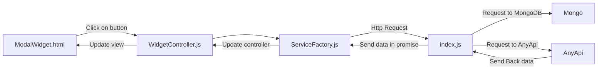

# Dashboard

Dashboard is an app on which you can log in and have access to 4 services which have widgets. The database on which the data are sent is MongoDB. The frontend is in AngularJS(html/css/javascript) and Bootstrap,  the backend is in NodeJS(Javascript).

### Run
```
npm install
npm run build
npm run docker
```
# Widgets
All the folowing widget has a custom name a creation date and a refresh timer on which the widgets refresh his data

# Twitch
It is deprecated to launch many streams on the app except if you possess a very good connection.
Twitch frame are used for this widget
### Stream
You have to put a **channel_name** that you can get on TwitchTv, and then this stream channel will be available on the widget
### Clip
You have to put a **clip_name** which is a strange arrangement of words that you can get on TwitchTv
# Yammer
First you have to log in your yammer account in the account part of the dashboard app otherwise it won't work.
Yammer JS SDK is used for this widget
### Message
You have to put the **limit** number of message you want. And then you're private message will be displayed on the widget
### Group
You have to put the **limit** number of message you want and the **group_id** that you can found on any Yammer group url. And then the message posted on this group will be displayed in the widget
### Thread
You have to put the **thread_id** of the thread that you can get on any thread url in Yammer or in the **Group widget's message** and then the whole thread will be displayed on your app
# Trade
Setting a small refresh timer on this app is deprecated because there is a limited number of API call per Minute.
Alpha avantage API is used for this widget
### Exchange
After selecting the **currency_from** which you want to convert and the **currency_to** on which you want to convert you will be able to see the exchange rate of these value
### Sector
After selectin the **sector** that you want to see the performance of and the **period** of time which will be used, you will be to see all the performance these sector did
# Weather
OpenWeatherMap is used for this widget
### Current Weather
After typing the name of the **city** that you wan to see the data of you will be able to see the weather and the temperature that these city currently have.

# Frontend Backend communication

Past it in [mermaid](https://mermaidjs.github.io/mermaid-live-editor/)

# Architecture
The application only has two states made with angular-ui-router
The Dashboard and AccountPage


To avoid duplication of code most part of the code are template therefore
if i want to add a Stream widget in the Twitch service I will have
"TwitchStreamController.js" -> "\<ServiceName\>\<WidgetName\>Controller.js"
and the html template will be
"widgetTwitchStream.html" -> "\widget<ServiceName\>\<WidgetName\>.html"
Then the html and controller are already linked thanks to ng-controller html templating

The dashboard page is composed of ng-repeat of service template of widget template
so it's very easy to add.
